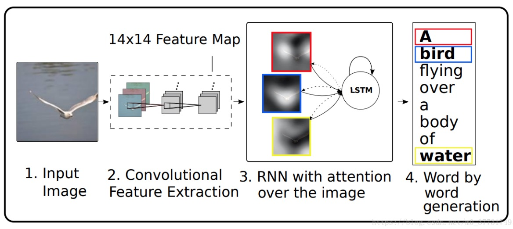
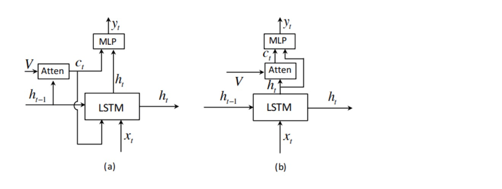
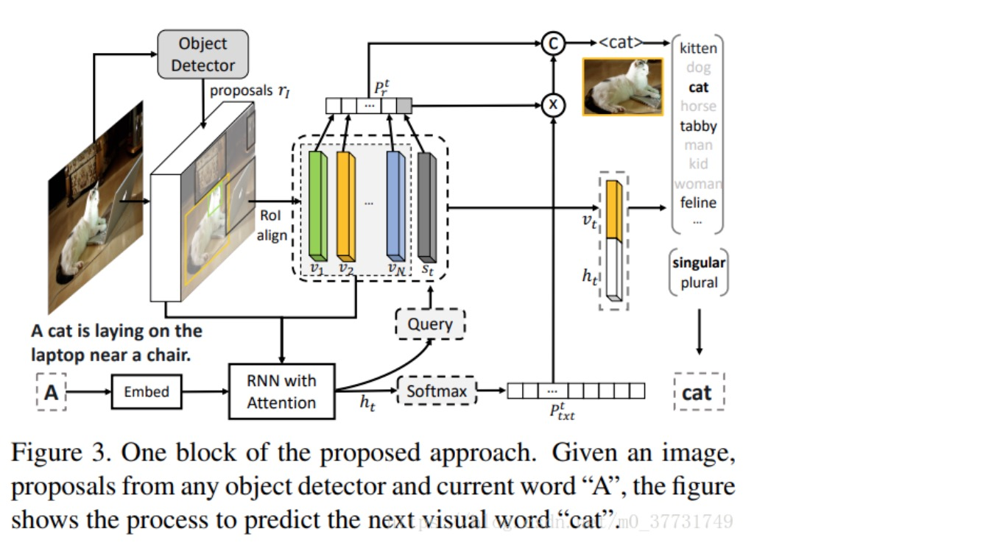

Image Caption 的基本结构包括encoder和decoder两部分。

早期的做法效果并不很好，主要有
> 《Baby Talk》

> 《Every picture tell a story》

它们主要利用图像处理的一些算子提取出图像的特征，经过SVM分类等得到图像中可能存在的目标object。根据提取出的object以及它们的属性，利用CRF或者一些认为制定的规则来恢复成对图像的描述。

现今的做法是，用CNN编码图像（机器翻译是用RNN编码）生成隐层变量，再利用解码器RNN读入隐层变量，逐步生成目标文字。

机器翻译decoder = 看图说话decoder

> Google: Show and tell (2015)

Google团队用Incetion中softmax前一层的数据作为图像编码后的特征，传入LSTM（可能需要乘以特定维度的矩阵来转换维度）。

> 李飞飞: NeuralTalk(VGG+RNN) (2015)

在接下来几年MSCOCO的leader board中，几乎都是这种框架拿第一。它的缺点：
1. 图像特征仅仅在开始的时候以bias的形式传入RNN
2. 只关注了全局特征
3. 模型在学习到了一种模板后再往里面进行填词

> Show attend and tell (cvpr 2016)

解决了1，2

不同于以往采用全连接层作为图像特征，这次是直接使用卷积层conv5_3(第5个卷积block里面的第3个卷积层)作为特征。特征图大小通常为7\*7\*512。每个时刻传入LSTM的是上一时刻的状态c，h以及加权过后的卷积层特征。attention在这里的作用就是加权，对应不同的加权方式，分了两种。

不再使用全连接层代表图像，而是卷积层a的加权得来的z来代表不同时刻的图像。

> knowing when to look

针对问题1，提出了一种自适应性的attention机制，是的模型可以自己决定生成单词的时候是根据先验知识（模板）还是根据图像中区域。整体思路如下：

与show and tell最主要不同的在于它attention机制：

利用ht而不是ht-1来决定看哪里，同时认为ct是ht的残差结构

[knowing when to look](https://blog.csdn.net/sinat_26253653/article/details/79416234)

> SCA-CNN

之前的工作都基于RNN，而CNN也不可忽略。

文章主要利用卷积层不同通道做attention，同时还利用了spatial attention机制：

由于卷积层不同通道所代表的信息不一样，比如图1中的cake经过卷积之后，并不是在所有卷积通道中都有响应，而是在特定的通道中出现了。提取出这些特定的通道，然后用spatial attention来处理图2得到最后的特征图。直观的角度来说，选取通道是决定看什么，spatial attention则是决定看哪里。最后得到的X显然比V的特征更具有纯粹性和代表性。

> Neural baby talk 和 bottom-up and top-down (cvpr 2018)

两者的共同点是都是用了object detection， 首先提取出图像中可能的物体，再进行描述生成。

很早以前的做法所获得图像描述往往都是和图像很相关，但是不流畅。而利用深度学习之后，生成的描述变得越来越流畅，但是相关性却大打折扣。

