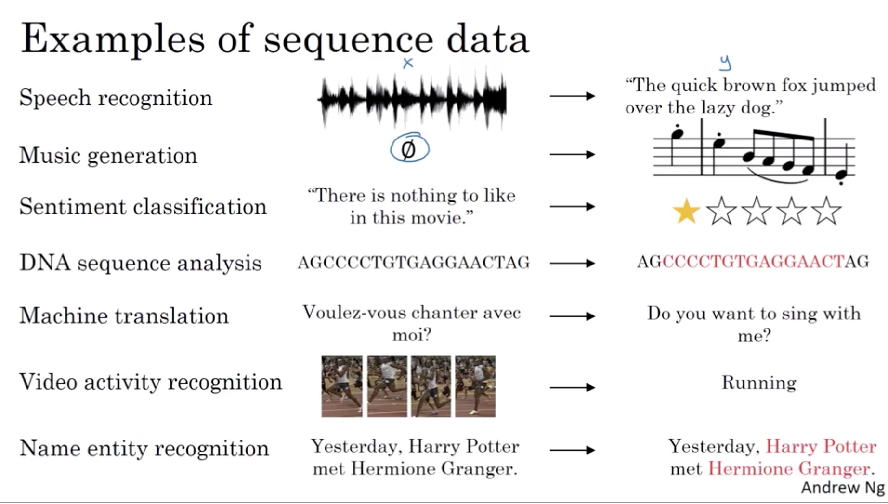
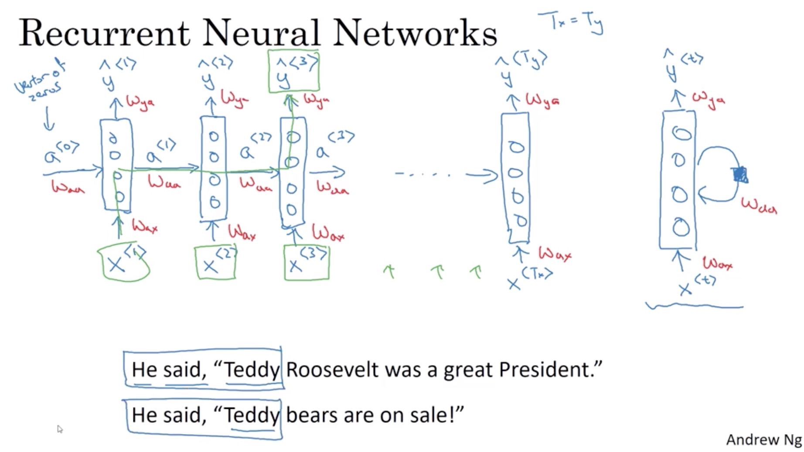
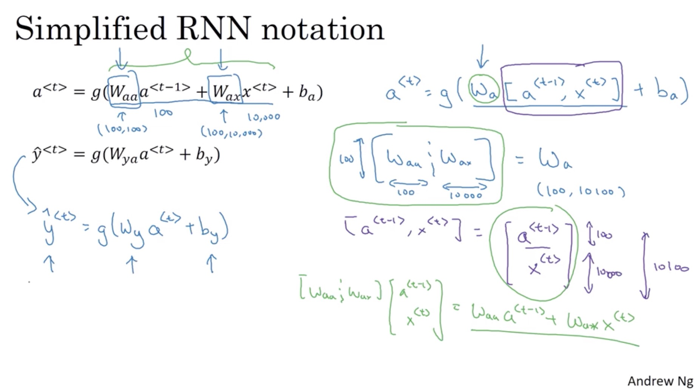
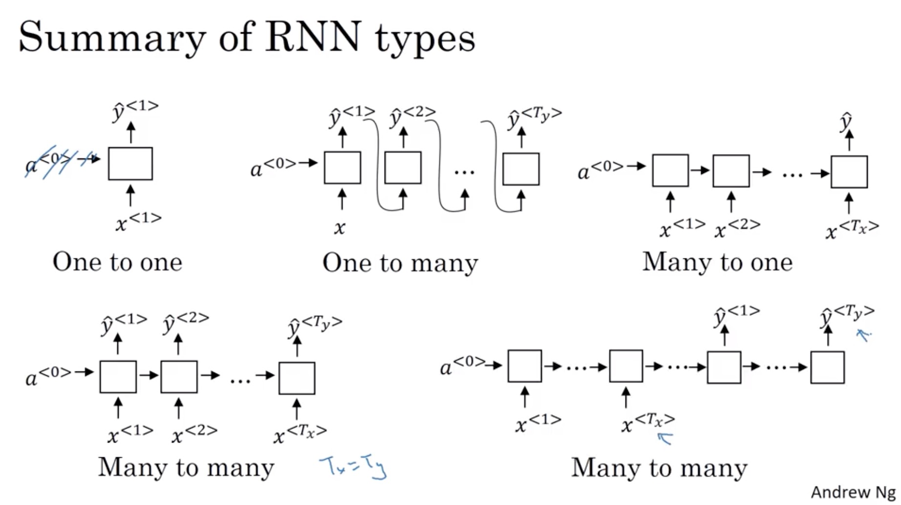
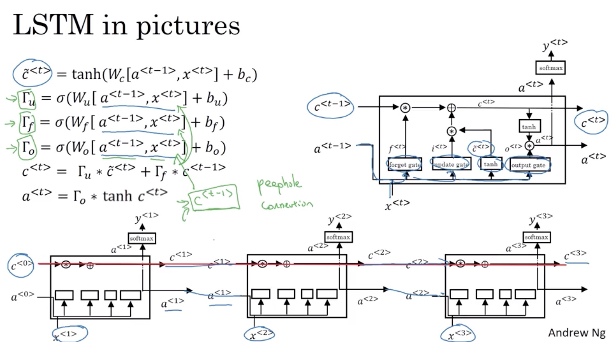

# Sequence Data

In some cases, both X and Y are sequences. For others, maybe X not or Y not.

# Representing words

> x: Harry Potter and Hermione Granger invented a new spell.

Come up with a vocabulary(dictionary):

> Vocabulary: [a, aaron, ..., and, ..., harry, ..., potter, zulu]

Each word is represented as a vector with only one 1 and others 0 (one-hot vector)

> length of vector = length of vocabulary

# Recurrent Neural Network

CNN can not use for sequence learning problem:

1. Inputs, outputs can be different lengths in different examples

2. Doesn't share features learnt across different position of text

- Parameters are shared in different steps

- Need to make up for a<0> (always all 0)

- Use the information before the stpe but not after (solution: BRNN)

# Forward Propagation

notation:

Wax: multiply **x-like** to compute **a-like**

- g1 might be tanh or ReLu

- g2 might be sigmoid

# Backward Propagation through time

# Different types of RNNs

#### one to many:

> music generation(sequence generation)

#### many to one:

> sentiment classification

#### many to many:

> ##### Tx == Ty:
> 
> name entity recognition
> 
> ##### Tx != Ty: (encoder and decoder)
> 
> machine translation

# RNN models

If meeting a word not in the vocabulary, use \<UNK> to represent.

# Sampling novel sequence

- Sampling a sequence from a trained RNN

- Character-level language model

#### Character-wise comparing to the word-wise:

- Can handle with \<UNK>
- End with much longer sequences, high qualily hardware required

# Vanishing gradients

- problem for **long-range dependencies:**

> The cat, which ... , was full.

> The cans, which ... , were full.

while generating 'was' or 'were', the model needs to remember the far earlier nouns, 'cat' and 'cats', which is difficult.

- Gradients explosion is also a problem:

> 1. Has "NAN"
> 
> 2. Solution: **Gradient Clipping** (If the gradient vector is bigger than the threshold, re-scale some vector so that it is not too big)

# Gated Recurrent Unit(GRU)

> c to keep some information for long time later(singular or plural)
> 
> gamma-u to decide while updating c or not(sigmoid)
> 
> gamma-u might be close to 0, so the value of c could be kept, and the problem of vanishing gradients solved.

# Long short term memory(LSTM)
 
> - GRU: simpler, faster, bigger models (2 gates)
> 
> - LSTM: mode powerful and effective (3 gates)

> red line indicates preventing of the vanishing gradients

> The * stands for element multiply

# Bidirectional RNN

> - pros: considers both previous and later content
> 
> - cons: need the whole content(so not for real-time project)

# Deep RNNs

> a[l]\<t>: activation of layer l and time t

> wa[l] and ba[l] for the layer. Same in the layer and different among layers

> 3 layers is quite big in RNN. May stack more layers with no horizontal connection
