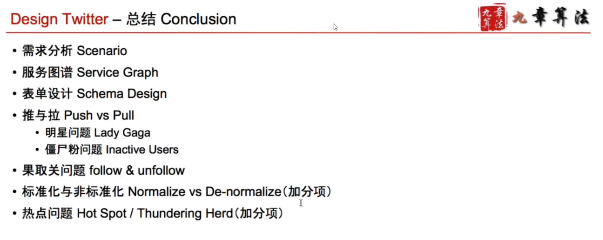
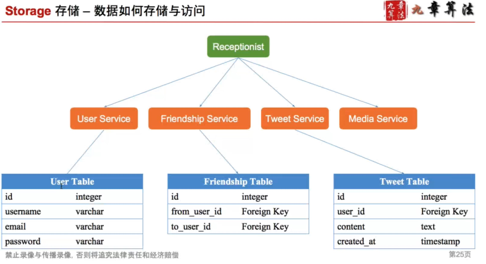

# Design Twitter

> 提前先问要求。现在想到的问的主要的问题：要什么功能，大概多少用户

- QPS: queries per second

> read QPS

> write QPS

- DAU: daily avg user

Peak Concurrent User / Avg Concurrent User 一般在 2 ~ 9

SOA: Service Oriented Architecture 面向服务的架构设计

#### 将大系统拆分为小服务：

1. User Service (Register, Login)
2. Tweet Service (Post a tweet, News feed, Timeline)
3. Media Service (Upload image, Upload video)
4. Friendship Service (Follow, Unfollow)

#### Storage

1. Select: 为每个Service选择存储结构
2. Schema: 细化表结构

分类：

1. SQL Database 关系型数据库 (user table)
2. NoSQL Database 非关系型数据库 (tweets, social graph(followers))
3. File System 文件系统 (media files)

> 数据库用到了文件系统。数据库里的数据还是存储在文件系统中的。文件系统更底层

> I/O时间一般比较大， 系统设计的速度瓶颈在于请求次数

pull model:

push model:

> fanout

pull的问题：I/O 慢
 
push的问题：
 
> 1. lady gaga发个推，要更新的东西太多
> 2. 不活跃用户会浪费资源。你更新了他的news feed，人家根本不看

解决pull的缺陷：

Memcached QPS / Mysql QPS 约为 100 ~ 1000

- when push:

> - 资源少
> - 用户发帖不多
> - 实时性要求不高
> - 双向好友

- when pull:

> - 资源多
> - 用户发帖多
> - 实时性要求高
> - 单向好友（关注）

关注和取关问题：

follow 或 unfollow 之后，要异步地将他的timeline 添加到你的news feed / 从你的news feed 中删除

> 异步。要确保用户第一时间能够感受到“我确实已经关注/取关他了”，而news feed 不一定要同一时间做完，可能会有一点延迟

- Likes 问题

> select count(*) 这个操作很慢

> 所以要de-normalize: 把需要count(*) 的赞数，评论数，转发数，另外存一份

> 如果明星发了某一条爆炸推特，这条推特会有很多赞，评论和转发，那么load balancer, sharding, consistent hashing 对这个都不管用，因为是同一条推特